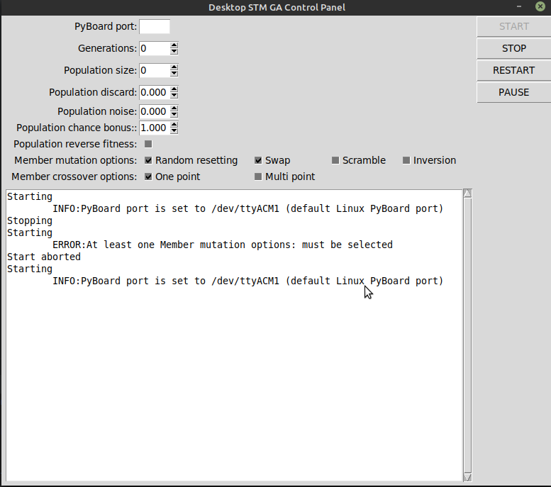

# TkinterEasyGui
Part of STM GA Optimization Project. Easy GUI creating.

## Features:

1. creating entries, entry consist of:
    - label describing entry
    - entry box: checkoboxes, spinbox or text entry
 2. creating buttons
 3. creating messagebox (named _console_)
 4. getting values of entries
 5. disabling/enabling buttons
 6. logging to messagebox(_console_) and terminal
 7. checking if values are valid (between given min and max)
 
 ## Example created using example_usage.py
 
